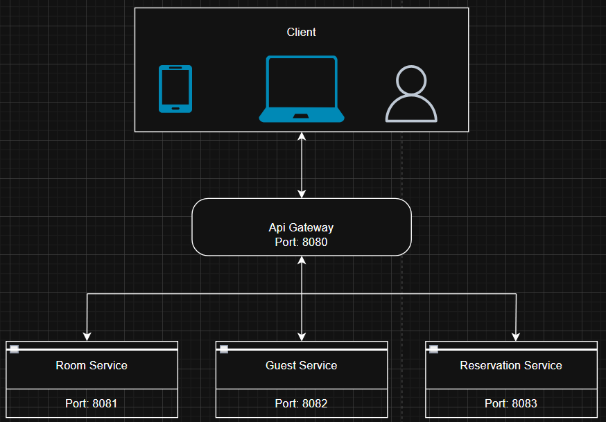

# Hotel Booking Platform

Cloud-native microservices backend built with Node.js, Docker, and Nginx.

## Architecture

Three independent microservices behind an Nginx API Gateway:

- **room-service** — manages hotel rooms (port 8081)
- **guest-service** — manages guests (port 8082)
- **reservation-service** — manages bookings, calls room and guest services (port 8083)
- **api-gateway** — Nginx reverse proxy, single entry point (port 8080)

## Getting Started

```bash
docker-compose up --build
```

All services are accessible through the gateway at `http://localhost:8080`.


## Architecture Diagram



## Cloud Integration

API documentation is hosted on Firebase Hosting:
https://hotel-booking-6247a.web.app

## File Architecture

```
├── Cloud-Native-App
│   ├── api-gateway
│   │   └── nginx.conf
│   ├── guest-service
│   │   ├── middleware
│   │   │   └── logger.js
│   │   ├── route
│   │   │   └── guests.js
│   │   ├── Dockerfile
│   │   ├── package.json
│   │   └── server.js
│   ├── reservation-service
│   │   ├── middleware
│   │   │   └── logger.js
│   │   ├── route
│   │   │   └── reservations.js
│   │   ├── Dockerfile
│   │   ├── package.json
│   │   └── server.js
│   ├── room-service
│   │   ├── middleware
│   │   │   └── logger.js
│   │   ├── route
│   │   │   └── rooms.js
│   │   ├── Dockerfile
│   │   ├── package.json
│   │   └── server.js
│   ├── README.md
│   ├── Screenshot 2026-02-26 183827.png
│   ├── architecture-diagram.png
│   └── docker-compose.yml
├── api-gateway
│   └── nginx.conf
├── guest-service
│   ├── middleware
│   │   └── logger.js
│   ├── route
│   │   └── guests.js
│   ├── Dockerfile
│   ├── firebase.js
│   ├── package.json
│   └── server.js
├── public
│   ├── 404.html
│   └── index.html
├── reservation-service
│   ├── middleware
│   │   └── logger.js
│   ├── route
│   │   └── reservations.js
│   ├── Dockerfile
│   ├── firebase.js
│   ├── package.json
│   └── server.js
├── room-service
│   ├── middleware
│   │   └── logger.js
│   ├── route
│   │   └── rooms.js
│   ├── Dockerfile
│   ├── firebase.js
│   ├── package.json
│   └── server.js
├── .firebaserc
├── .gitignore
├── README.md
├── architecture-diagram.png
├── docker-compose.yml
├── firebase.json
├── postman-collection.json
└── {
```


## Tech Stack

- Node.js + Express
- Nginx (API Gateway)
- Docker + Docker Compose
- Firebase Hosting

## Hosting Link

https://hotel-booking-6247a.web.app


## Author

Youssef Kazti
